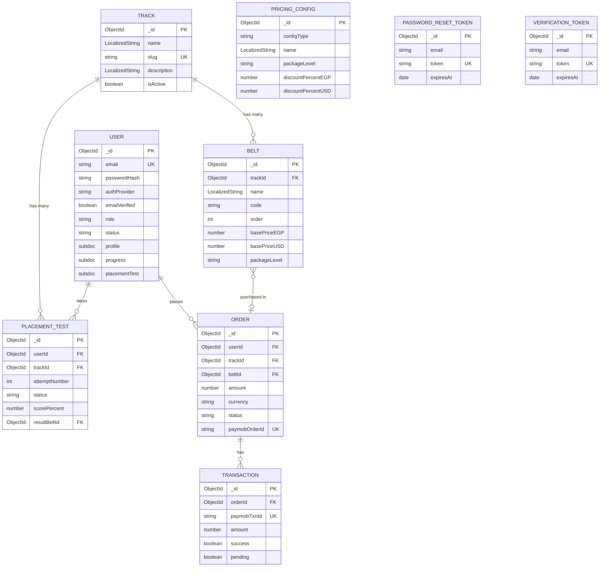

# NGEN Database - Entity Relationship Diagram (ERD)

> **Generated on:** 2026-01-02  
> **Database:** MongoDB Atlas  
> **ODM:** Mongoose

---

## 📊 High-Level Overview

```
┌─────────────────────────────────────────────────────────────────────────────────────────┐
│                                    NGEN DATABASE SCHEMA                                  │
├─────────────────────────────────────────────────────────────────────────────────────────┤
│                                                                                          │
│   ┌─────────────┐          ┌─────────────┐          ┌─────────────────────┐            │
│   │    TRACK    │ 1 ───→ N │    BELT     │          │   PRICING CONFIG    │            │
│   └─────────────┘          └─────────────┘          └─────────────────────┘            │
│         │                        │                                                       │
│         │                        │                                                       │
│         ▼                        ▼                                                       │
│   ┌─────────────────────────────────────────────────────────────┐                       │
│   │                          USER                                │                       │
│   │  ┌──────────────────────────────────────────────────────────┐│                       │
│   │  │  • profile (subdoc)                                      ││                       │
│   │  │  • progress (subdoc) → refs Track, Belt                  ││                       │
│   │  │  • placementTest summary (subdoc) → refs PlacementTest   ││                       │
│   │  └──────────────────────────────────────────────────────────┘│                       │
│   └─────────────────────────────────────────────────────────────┘                       │
│              │                                   │                                       │
│              │                                   │                                       │
│              ▼                                   ▼                                       │
│   ┌─────────────────────┐               ┌─────────────────────┐                         │
│   │   PLACEMENT TEST    │               │       ORDER         │                         │
│   └─────────────────────┘               └─────────────────────┘                         │
│                                                  │                                       │
│                                                  │                                       │
│                                                  ▼                                       │
│                                         ┌─────────────────────┐                         │
│                                         │    TRANSACTION      │                         │
│                                         └─────────────────────┘                         │
│                                                                                          │
│   ┌─────────────────────────────────────────────────────────────────────────────────┐   │
│   │                        AUTHENTICATION TOKENS                                     │   │
│   │    ┌─────────────────────────┐       ┌─────────────────────────┐               │   │
│   │    │  PASSWORD RESET TOKEN   │       │   VERIFICATION TOKEN    │               │   │
│   │    └─────────────────────────┘       └─────────────────────────┘               │   │
│   └─────────────────────────────────────────────────────────────────────────────────┘   │
│                                                                                          │
└─────────────────────────────────────────────────────────────────────────────────────────┘
```

---

## 📋 Detailed Entity Descriptions

### 1. **TRACK** Collection

Educational track/course category.

```
┌──────────────────────────────────────────────────────────────────┐
│                            TRACK                                  │
├──────────────────────────────────────────────────────────────────┤
│  _id           : ObjectId (PK)                                   │
│  name          : LocalizedString { en: String, ar: String }      │
│  slug          : String (UNIQUE, lowercase)                      │
│  description   : LocalizedString { en: String, ar: String }      │
│  isActive      : Boolean (default: true)                         │
│  createdAt     : Date                                            │
│  updatedAt     : Date                                            │
├──────────────────────────────────────────────────────────────────┤
│  INDEXES:                                                        │
│  • slug (unique)                                                 │
└──────────────────────────────────────────────────────────────────┘
```

**Available Tracks:**
- Programming (البرمجة)
- Artificial Intelligence (الذكاء الاصطناعي)
- Cybersecurity (الأمن السيبراني)
- Data Science (علوم البيانات)
- Robotics (الروبوتات)
- Creative Arts (الفنون الإبداعية)

---

### 2. **BELT** Collection

Skill level within a track (Martial arts belt system).

```
┌──────────────────────────────────────────────────────────────────┐
│                             BELT                                  │
├──────────────────────────────────────────────────────────────────┤
│  _id              : ObjectId (PK)                                │
│  trackId          : ObjectId (FK → Track)                        │
│  name             : LocalizedString { en: String, ar: String }   │
│  code             : String (UPPERCASE) e.g., "WHITE", "BLACK"    │
│  order            : Number (1-10, progression order)             │
│  description      : LocalizedString { en: String, ar: String }   │
│  minScoreToStart  : Number (0-100, placement test threshold)     │
│  basePriceEGP     : Number (price in Egyptian Pounds)            │
│  basePriceUSD     : Number (price in US Dollars)                 │
│  packageLevel     : Enum ['pre-foundation', 'foundation',        │
│                          'specialization', 'advanced']           │
│  purchaseUrl      : String (optional external URL)               │
│  createdAt        : Date                                         │
│  updatedAt        : Date                                         │
├──────────────────────────────────────────────────────────────────┤
│  INDEXES:                                                        │
│  • (trackId, order) - compound                                   │
│  • code                                                          │
└──────────────────────────────────────────────────────────────────┘
```

**Belt Progression (Order 1→10):**

| Order | Belt Code | Package Level    | EGP Price | USD Price |
|-------|-----------|------------------|-----------|-----------|
| 1     | WHITE     | pre-foundation   | 5,000     | 100       |
| 2     | YELLOW    | foundation       | 9,000     | 200       |
| 3     | ORANGE    | foundation       | 9,000     | 200       |
| 4     | GREEN     | foundation       | 9,000     | 200       |
| 5     | BLUE      | specialization   | 9,000     | 200       |
| 6     | RED       | specialization   | 9,000     | 200       |
| 7     | BROWN     | specialization   | 9,000     | 200       |
| 8     | BLACK     | specialization   | 9,000     | 200       |
| 9     | NINJA     | advanced         | 18,000    | 400       |
| 10    | MASTER    | advanced         | 18,000    | 400       |

---

### 3. **USER** Collection

Main user/student entity with embedded subdocuments.

```
┌──────────────────────────────────────────────────────────────────┐
│                             USER                                  │
├──────────────────────────────────────────────────────────────────┤
│  _id                  : ObjectId (PK)                            │
│  email                : String (UNIQUE, lowercase, validated)    │
│  passwordHash         : String (select: false - hidden)          │
│  authProvider         : Enum ['email','google','apple','facebook']│
│  emailVerified        : Boolean (default: false)                 │
│  role                 : Enum ['student', 'parent', 'superadmin'] │
│  status               : Enum ['pending','active','suspended',    │
│                               'deleted']                         │
│  profile              : SUBDOCUMENT (see below)                  │
│  progress             : SUBDOCUMENT (see below)                  │
│  placementTest        : SUBDOCUMENT (see below)                  │
│  detectedCountry      : String                                   │
│  detectedCountryCode  : String (uppercase, e.g., "EG", "US")     │
│  signupIP             : String                                   │
│  lastLoginAt          : Date                                     │
│  createdAt            : Date                                     │
│  updatedAt            : Date                                     │
├──────────────────────────────────────────────────────────────────┤
│  INDEXES:                                                        │
│  • email (unique - automatic)                                    │
│  • status                                                        │
│  • profile.joinType                                              │
└──────────────────────────────────────────────────────────────────┘
```

#### User.profile (Embedded Subdocument)
```
┌──────────────────────────────────────────────────────────────────┐
│                       USER.PROFILE                                │
├──────────────────────────────────────────────────────────────────┤
│  firstName           : String (required)                         │
│  lastName            : String (required)                         │
│  fullName            : String (auto-generated)                   │
│  phoneNumber         : String                                    │
│  parentPhoneNumber   : String                                    │
│  primaryContactType  : Enum ['student', 'parent']                │
│  age                 : Number (required, min: 1)                 │
│  dateOfBirth         : Date                                      │
│  address             : { country: String, city: String }         │
│  joinType            : Enum ['individual', 'organization']       │
│  organizationName    : String                                    │
│  howDidYouKnowNgen   : String (required)                         │
│  avatarUrl           : String                                    │
└──────────────────────────────────────────────────────────────────┘
```

#### User.progress (Embedded Subdocument)
```
┌──────────────────────────────────────────────────────────────────┐
│                      USER.PROGRESS                                │
├──────────────────────────────────────────────────────────────────┤
│  currentTrackId       : ObjectId (FK → Track)                    │
│  currentTrackName     : String (denormalized)                    │
│  currentBeltId        : ObjectId (FK → Belt)                     │
│  currentBeltName      : String (denormalized)                    │
│  beltLevel            : Number                                   │
│  trackStartedAt       : Date                                     │
│  lastProgressUpdateAt : Date                                     │
│  completedBelts       : [ObjectId] (FK → Belt[])                 │
└──────────────────────────────────────────────────────────────────┘
```

#### User.placementTest (Embedded Subdocument)
```
┌──────────────────────────────────────────────────────────────────┐
│                   USER.PLACEMENTTEST                              │
├──────────────────────────────────────────────────────────────────┤
│  hasTakenAnyPlacementTest     : Boolean (default: false)         │
│  allowedAttempts              : Number (default: 1)              │
│  attemptsUsed                 : Number (default: 0)              │
│  remainingAttempts            : Number                           │
│  extraAttemptsGrantedBySupport: Number (default: 0)              │
│  lastPlacementTestId          : ObjectId (FK → PlacementTest)    │
│  lastPlacementTrackId         : ObjectId (FK → Track)            │
│  lastPlacementTrackName       : String                           │
│  resultBeltId                 : ObjectId (FK → Belt)             │
│  resultBeltName               : String                           │
│  resultScorePercent           : Number (0-100)                   │
│  takenAt                      : Date                             │
└──────────────────────────────────────────────────────────────────┘
```

---

### 4. **PLACEMENT TEST** Collection

Records of placement tests taken by users.

```
┌──────────────────────────────────────────────────────────────────┐
│                       PLACEMENT TEST                              │
├──────────────────────────────────────────────────────────────────┤
│  _id             : ObjectId (PK)                                 │
│  userId          : ObjectId (FK → User)                          │
│  trackId         : ObjectId (FK → Track)                         │
│  trackName       : String (denormalized)                         │
│  attemptNumber   : Number (min: 1)                               │
│  status          : Enum ['in_progress', 'completed', 'cancelled']│
│  scorePercent    : Number (0-100)                                │
│  resultBeltId    : ObjectId (FK → Belt)                          │
│  resultBeltName  : String (denormalized)                         │
│  questions       : [SUBDOCUMENT] (see below)                     │
│  startedAt       : Date                                          │
│  completedAt     : Date                                          │
│  createdAt       : Date                                          │
│  updatedAt       : Date                                          │
├──────────────────────────────────────────────────────────────────┤
│  INDEXES:                                                        │
│  • userId                                                        │
│  • (userId, trackId) - compound                                  │
│  • status                                                        │
└──────────────────────────────────────────────────────────────────┘
```

#### PlacementTest.questions[] (Embedded Array)
```
┌──────────────────────────────────────────────────────────────────┐
│                PLACEMENT_TEST.QUESTIONS[]                         │
├──────────────────────────────────────────────────────────────────┤
│  questionId        : String                                      │
│  selectedOptionId  : String                                      │
│  isCorrect         : Boolean                                     │
│  points            : Number                                      │
│  timeTakenSeconds  : Number                                      │
└──────────────────────────────────────────────────────────────────┘
```

---

### 5. **ORDER** Collection

Purchase orders for belts/tracks (Paymob integration).

```
┌──────────────────────────────────────────────────────────────────┐
│                           ORDER                                   │
├──────────────────────────────────────────────────────────────────┤
│  _id            : ObjectId (PK)                                  │
│  userId         : ObjectId (FK → User, optional)                 │
│  trackId        : ObjectId (FK → Track, optional)                │
│  beltId         : ObjectId (FK → Belt, optional)                 │
│  amount         : Number (required, min: 0)                      │
│  currency       : Enum ['EGP', 'USD'] (default: 'EGP')           │
│  status         : Enum ['pending','paid','failed','refunded']    │
│  paymobOrderId  : String (unique, sparse)                        │
│  transactionId  : String                                         │
│  paymentMethod  : Enum ['card', 'wallet']                        │
│  customerName   : String (required)                              │
│  customerEmail  : String (required, lowercase)                   │
│  customerPhone  : String (required)                              │
│  metadata       : Mixed/Object (flexible storage)                │
│  createdAt      : Date                                           │
│  updatedAt      : Date                                           │
├──────────────────────────────────────────────────────────────────┤
│  INDEXES:                                                        │
│  • customerEmail                                                 │
│  • status                                                        │
│  • createdAt (descending)                                        │
│  • userId                                                        │
│  • paymobOrderId (unique, sparse)                                │
└──────────────────────────────────────────────────────────────────┘
```

---

### 6. **TRANSACTION** Collection

Payment transaction records from Paymob webhooks.

```
┌──────────────────────────────────────────────────────────────────┐
│                        TRANSACTION                                │
├──────────────────────────────────────────────────────────────────┤
│  _id           : ObjectId (PK)                                   │
│  orderId       : ObjectId (FK → Order)                           │
│  paymobTxnId   : String (unique)                                 │
│  amount        : Number (required, min: 0)                       │
│  currency      : String (default: 'EGP')                         │
│  success       : Boolean                                         │
│  pending       : Boolean                                         │
│  responseData  : Mixed/Object (raw Paymob webhook data)          │
│  errorMessage  : String                                          │
│  createdAt     : Date (auto, no updatedAt)                       │
├──────────────────────────────────────────────────────────────────┤
│  INDEXES:                                                        │
│  • orderId                                                       │
│  • createdAt (descending)                                        │
│  • paymobTxnId (unique)                                          │
└──────────────────────────────────────────────────────────────────┘
```

---

### 7. **PRICING CONFIG** Collection

Pricing rules and package configurations.

```
┌──────────────────────────────────────────────────────────────────┐
│                       PRICING CONFIG                              │
├──────────────────────────────────────────────────────────────────┤
│  _id               : ObjectId (PK)                               │
│  configType        : Enum ['perBelt', 'package', 'organization'] │
│  name              : LocalizedString { en: String, ar: String }  │
│  packageLevel      : Enum ['pre-foundation', 'foundation',       │
│                           'specialization', 'advanced']          │
│  discountPercentEGP: Number (0-100, default: 0)                  │
│  discountPercentUSD: Number (0-100, default: 0)                  │
│  fixedPriceEGP     : Number (optional)                           │
│  fixedPriceUSD     : Number (optional)                           │
│  belts             : [String] (belt codes in package)            │
│  isActive          : Boolean (default: true)                     │
│  createdAt         : Date                                        │
│  updatedAt         : Date                                        │
├──────────────────────────────────────────────────────────────────┤
│  INDEXES:                                                        │
│  • (configType, isActive) - compound                             │
│  • packageLevel                                                  │
└──────────────────────────────────────────────────────────────────┘
```

**Available Pricing Configurations:**

| Config Type   | Package Level    | EGP Price | USD Price | Discount |
|---------------|------------------|-----------|-----------|----------|
| perBelt       | -                | -         | -         | 50%      |
| package       | foundation       | 12,000    | 265       | 56%      |
| package       | specialization   | 16,000    | 355       | 56%      |
| package       | advanced         | 15,000    | 330       | 59%      |
| organization  | -                | -         | -         | 0%       |

---

### 8. **PASSWORD RESET TOKEN** Collection

Temporary tokens for password reset flow.

```
┌──────────────────────────────────────────────────────────────────┐
│                    PASSWORD RESET TOKEN                           │
├──────────────────────────────────────────────────────────────────┤
│  _id        : ObjectId (PK)                                      │
│  email      : String (lowercase)                                 │
│  token      : String (unique, 64-char hex)                       │
│  expiresAt  : Date (default: +1 hour, TTL auto-delete)           │
│  createdAt  : Date                                               │
├──────────────────────────────────────────────────────────────────┤
│  INDEXES:                                                        │
│  • expiresAt (TTL - auto-delete expired docs)                    │
│  • (email, token) - compound                                     │
│  • token (unique)                                                │
└──────────────────────────────────────────────────────────────────┘
```

---

### 9. **VERIFICATION TOKEN** Collection

Temporary tokens for email verification.

```
┌──────────────────────────────────────────────────────────────────┐
│                     VERIFICATION TOKEN                            │
├──────────────────────────────────────────────────────────────────┤
│  _id        : ObjectId (PK)                                      │
│  email      : String (lowercase)                                 │
│  token      : String (unique, 64-char hex)                       │
│  expiresAt  : Date (default: +24 hours, TTL auto-delete)         │
│  createdAt  : Date                                               │
├──────────────────────────────────────────────────────────────────┤
│  INDEXES:                                                        │
│  • expiresAt (TTL - auto-delete expired docs)                    │
│  • (email, token) - compound                                     │
│  • token (unique)                                                │
└──────────────────────────────────────────────────────────────────┘
```

---

## 🔗 Relationship Diagram (Mermaid)



---

## 📊 Collection Statistics

| Collection            | Est. Doc Size | Key Relationships                    |
|-----------------------|---------------|--------------------------------------|
| Track                 | ~500 bytes    | Parent of Belt, PlacementTest        |
| Belt                  | ~600 bytes    | Child of Track, used in Order        |
| User                  | ~2-3 KB       | Has PlacementTest, Order             |
| PlacementTest         | ~1-2 KB       | Belongs to User, Track               |
| Order                 | ~800 bytes    | Belongs to User, has Transactions    |
| Transaction           | ~1 KB         | Belongs to Order                     |
| PricingConfig         | ~400 bytes    | Standalone, refs Belt codes          |
| PasswordResetToken    | ~200 bytes    | Refs User by email                   |
| VerificationToken     | ~200 bytes    | Refs User by email                   |

---

## 🌐 Bilingual Support (LocalizedString)

The database uses a `LocalizedString` type for internationalization:

```typescript
interface LocalizedString {
    en: string;  // English
    ar: string;  // Arabic
}
```

**Fields using LocalizedString:**
- `Track.name`, `Track.description`
- `Belt.name`, `Belt.description`
- `PricingConfig.name`

---

## 🔐 Security Notes

1. **passwordHash** is never returned in queries by default (`select: false`)
2. **Token collections** use TTL indexes for automatic expiration
3. **Email fields** are always lowercased and trimmed
4. **Unique constraints** prevent duplicates on critical fields

---

## 📁 Model File Locations

```
lib/models/
├── Belt.ts              # Belt skill levels
├── Order.ts             # Purchase orders
├── PasswordResetToken.ts # Password reset flow
├── PlacementTest.ts     # Placement test records
├── PricingConfig.ts     # Pricing rules
├── Track.ts             # Educational tracks
├── Transaction.ts       # Payment transactions
├── User.ts              # User accounts
└── VerificationToken.ts  # Email verification
```
